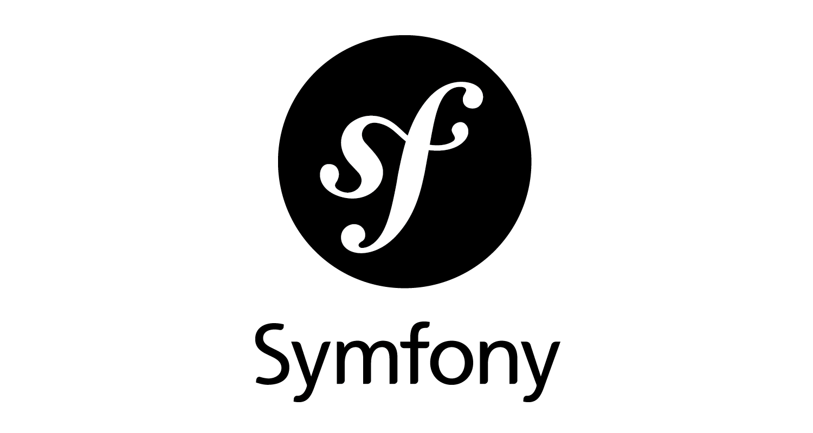

# MVC-Course
===========================================

## Welcome to the repo of the MVC-course for malw24!

This is the repo of student malw24 for the MVC-course (Model View Controller).
The course, using PHP, Symfony and databases, aims to teach and further the understanding of object-oriented programming techniques.
Unit testing will also be a part of the course.

#### How to clone the repo  

1. Create a folder for where you want the repo to be located.
2. Move to the folder in your terminal using cd.
3. Using SSH enter the following line to clone the repo into your specified folder: `git clone git@github.com:malw24/mvc-course.git`
